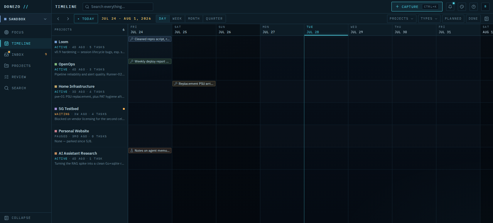

# donezo

A personal work-memory and attention system, self-hosted.



donezo captures tasks, reminders, notes, and completed work with minimal
friction, recovers context after interruptions, and shows where effort
actually went on a project-by-time timeline — **Project Pulse**, above.
The core loop is **capture → orient → act → reflect**: get things out of
your head without deciding what they are yet, see what deserves attention
now, keep one clear next action per project, and let the timeline show
what actually happened rather than what you planned.

## Self-hosting

One command installs donezo — a single Go binary plus SQLite, no external
database — on any systemd Linux host (amd64/arm64):

```sh
curl -fsSL https://raw.githubusercontent.com/bgrewell/donezo/main/install.sh | sudo bash
```

Your data lives in plain SQLite files under your control — one per space
— with automatic backups on every upgrade. Re-run the same command to
upgrade in place; see [`docs/install.md`](docs/install.md) for the full
reference, configuration options, and uninstalling.

## Using donezo

Press **Ctrl/Cmd+K** from anywhere to capture a thought — type it and
hit Enter to file it as a task, note, reminder, or logged activity, or
Ctrl/Cmd+Enter to drop it in your **Inbox** unclassified and decide
later. Capture is designed to cost zero decisions in the moment.

- **Timeline** (Project Pulse) shows every project as a row and time
  running left to right — what you actually did, zoomable from day to
  quarter.
- **Focus** answers "what should I do right now": one highlighted next
  action per active thread, what's time-sensitive, and what you were
  doing before you got interrupted.
- **Inbox** holds raw captures until you're ready to classify them —
  or don't; nothing forces a decision before it's cheap to make.
- **Review** gently resurfaces things that have gone quiet, in calm
  language ("still relevant?"), never as overdue-and-red.

## Multi-user & spaces

The first account created is the **owner**. Invite others from the
avatar menu — each person gets their own account and their own private
starting space, with no visibility into anyone else's data. Within your
own account, a **space** is an isolated workspace (work, personal,
a specific project) you switch between from the nav rail.

## Connect an AI

donezo speaks [MCP](https://modelcontextprotocol.io), so you can wire
Claude Code, Claude Desktop, or another MCP client straight into your
own data — capture a thought mid-conversation, ask what's next, log
what you just did. Mint a token from the avatar menu (**Connect your
AI…**); see [`docs/mcp.md`](docs/mcp.md) for setup and what a connected
model can and can't do.

## Development

Contributions welcome. Running donezo from source, the monorepo layout,
and the frontend/backend dev loops are in
[`CONTRIBUTING.md`](CONTRIBUTING.md); the full HTTP/MCP wire reference is
in [`docs/api.md`](docs/api.md).

## License

donezo is released under the [GNU AGPL-3.0](LICENSE).
Copyright (C) 2026 Ben Grewell.
